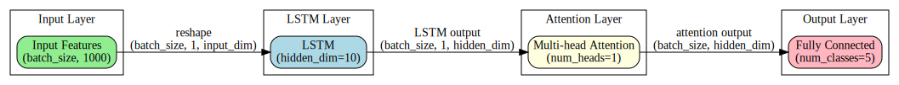

# LSTM with Multi-head Attention for Sentiment Analysis

This project implements a sentiment analysis model based on LSTM and multi-head attention mechanism. By integrating TF-IDF feature extraction and multi-head attention, the model significantly improves the performance of text sentiment analysis.

## Model Architecture



The model consists of the following key components:

1. **Input Layer**: Receives batch input features (batch_size, input_dim)
2. **LSTM Layer**: Processes sequence data using LSTM with hidden dimension of 10
3. **Multi-head Attention Layer**: Implements single-head attention mechanism to enhance focus on important features
4. **Fully Connected Output Layer**: Maps features to final classification results

## Key Features

- Integration of TF-IDF feature extraction
- Enhanced feature learning through multi-head attention mechanism
- Approximately 12% accuracy improvement over standard LSTM models
- Achieved 80.28% accuracy on the test set

## Performance Advantages

- Significant improvements in accuracy, recall, and F1 score compared to baseline models
- Ablation experiments demonstrate the necessity of all modules
- Multi-head attention mechanism contributes most to performance improvement

## Applications

- Public opinion monitoring
- Product recommendation systems
- User sentiment analysis
- Text classification tasks

## Usage Guide

### Requirements

```
torch
pandas
numpy
scikit-learn
matplotlib
seaborn
graphviz
```

### Running Instructions

1. Data Preparation:
   ```python
   # Data should be saved in Excel format with labels in the last column
   data = pd.read_excel('output.xlsx')
   ```

2. Training the Model:
   ```python
   python lstm_pytorch.py
   ```

3. Output Results:
   - Best model weights are saved to `best_model.pth`
   - Training process plots are saved as `training_process.png`
   - Detailed logs are saved in `training_log_[timestamp].txt`

## Visualization

The model provides comprehensive visualization tools for model analysis:

- Network Structure: Automatically generates network architecture diagram (`network_structure.svg`)
- Model Performance: 
  - Confusion matrix visualization (`confusion_matrix.png`)
  - ROC curves for multi-class classification (`roc_curves.png`)
  - Training and validation metrics plots (`training_process.png`)
  - Detailed training logs (`training_log_[timestamp].txt`)

All visualization results are automatically saved during the training process. You can find these files in the project root directory after running `lstm_pytorch.py`.

## Reference

[Advancing Sentiment Analysis: A Novel LSTM Framework with Multi-head Attention]

## License

MIT License 